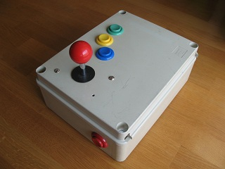
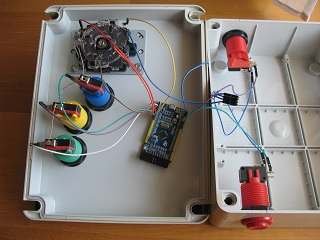
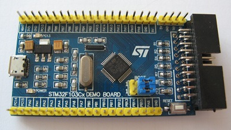

### USB keyboard

I'm planning on building my own MAME cabinet sometime in the future. One of
the things you need is a keyboard controller to hook up the buttons to. While there
are keyboard controllers available on eBay and elsewhere for this purpose
(some for as low as 30 euro),  I thought this would be a good opportunity
to make my own and learn some USB HID.

This is a mockup of an arcade control panel I made to test it.

[](images/IMG_2209.jpg)
[](images/IMG_2211.jpg)

The board is a development board from eBay for 3 euro, just search for STM32F103.
There are a few versions of these boards floating around, pretty much any will
do as long as it has USB.



The advantage of this type of controller over a traditional keyboard controller is
that it has a dedicated line for each button. This means the button presses can be
detected faster since the controller does not need to sequentially scan rows of
a key matrix. Another thing is the [key rollover](https://en.wikipedia.org/wiki/Rollover_(key)).
A dedicated line for each button make this type of controller NKRO hardware wise, whereas
for a typical keyboard, it depends on the key matrix layout.

There is also a software limitation on how many keys the keyboard can report. This
limitation comes from the HID report packet size. A typical keyboard will use an 8 byte packet
structured like this:

Byte|Purpose
----|-------
0|A bit mask specifying the state of the modifier keys (LCtrl,LShift,LAlt,LGUI,RCtrl,RShift,RAlt,RGUI).
1|Reserved for manufacturer use. Typically not used
2..7|The remaining 6 bytes specify up to 6 pressed keys. A zero means no key.

This makes a typical keyboard 6KRO software wise (not counting the modifier keys). You can test how
many keys your keyboard can report by pressing several keys one after another and not releasing any of them.

I've extended the packet size to 16 bytes, so the controller can report 14 pressed keys.

Key mapping:

Pin|PA0|PA1|PA2|PA3|PA4|PA5|PA6|PA7|PA8|PA9|PA10|PA15
---|---|---|---|---|---|---|---|---|---|---|----|----
Key|a  |b  |c  |d  |e  |f  |g  |h  |i  |j  |k   |l

Pin|PB0|PB1|PB4|PB5|PB6|PB7|PB8|PB9|PB10|PB11|PB12|PB13|PB14|PB15
---|---|---|---|---|---|---|---|---|----|----|----|----|----|----
Key|m  |n  |o  |p  |q  |r  |s  |t  |u   |v   |w   |x   |y   |z


As you can see, I've simply mapped the alphabet keys to the pins, but this can easily be changed in the source.

```c
#define NKEYS 26

const uint8_t keypin[NKEYS] = {
	0,1,2,3,4,5,6,7,8, 9, 10,15,			// PA0..PA10, PA15
	0,1,4,5,6,7,8,9,10,11,12,13,14,15		// PB0, PB1, PB4..PB15
};

GPIO_TypeDef* const keyport[NKEYS] = {
	GPIOA,GPIOA,GPIOA,GPIOA,GPIOA,GPIOA,GPIOA,GPIOA,GPIOA,GPIOA,GPIOA,GPIOA,
	GPIOB,GPIOB,GPIOB,GPIOB,GPIOB,GPIOB,GPIOB,GPIOB,GPIOB,GPIOB,GPIOB,GPIOB,GPIOB,GPIOB
};

const uint8_t keycode[NKEYS] = { // map pins to keyboard "scan codes" (from HID usage tables v1.12)
	4,5,6,7,8,9,10,11,12,13,14,15,16,17,18,19,20,21,22,23,24,25,26,27,28,29 // a..z
};
```
